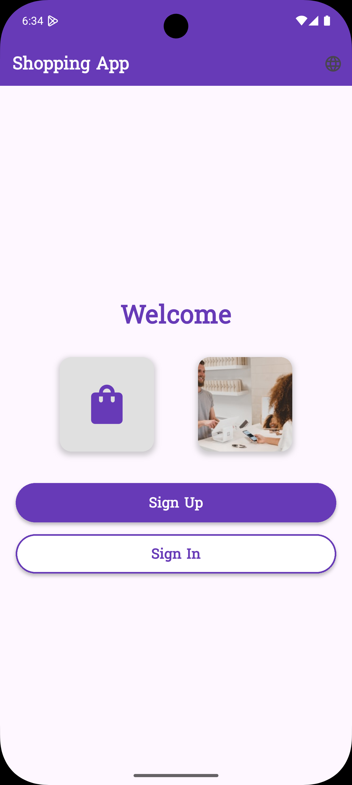
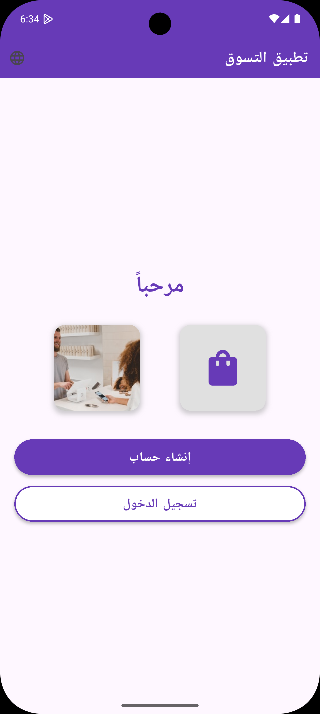
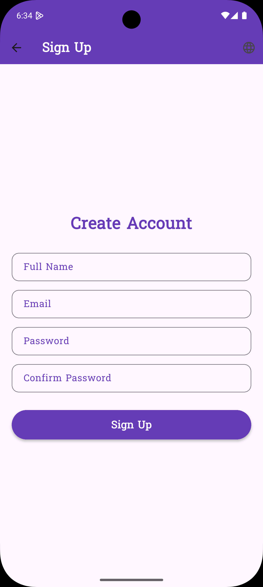
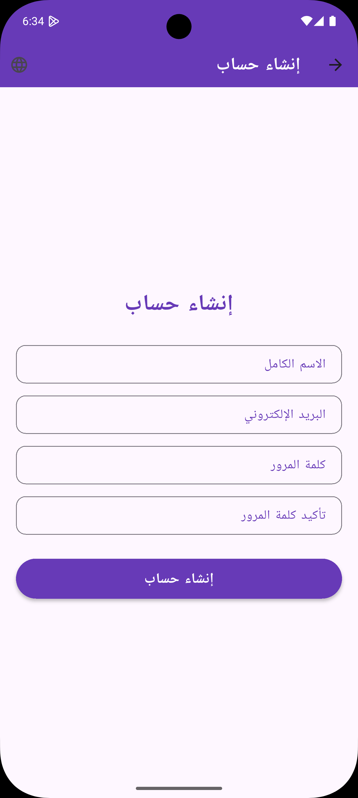
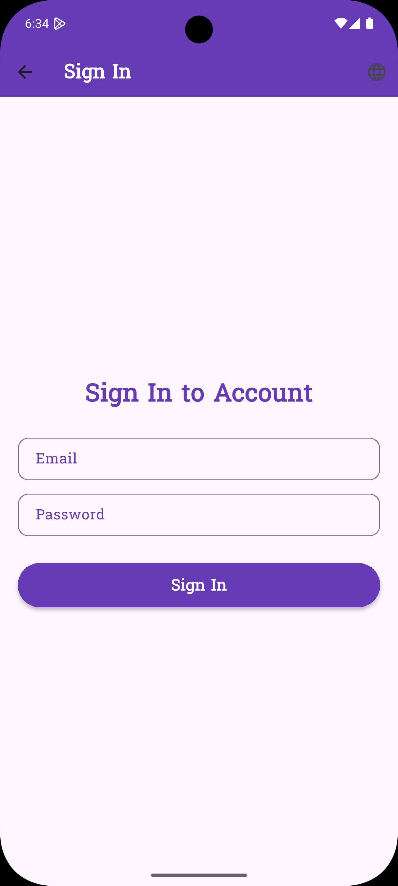
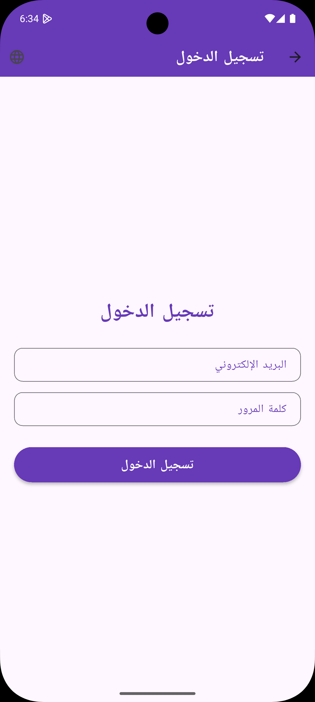
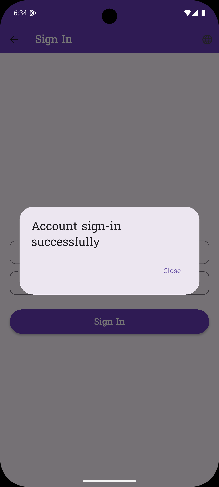

# Flutter Shopping App

## Overview
This is a comprehensive Flutter application simulating a shopping interface with user authentication, product browsing, and Arabic localization.

## Features
- Aesthetic Welcome Screen with custom fonts and images.
- Sign-up and Sign-in forms with input validation.
- Smooth animated navigation to the Shopping Home Screen.
- Interactive Shopping Home with featured products, a product grid, and hot offers.
- Arabic language support using localization.

## Setup Instructions
1. Ensure Flutter SDK is installed.
2. Clone the repository: `git clone https://github.com/Karim9242/karim`
3. Navigate to the project folder: `cd flutter-shopping-app`
4. Install dependencies: `flutter pub get`
5. Run the app: `flutter run`

## Screenshots

### Welcome Screen

### Sign-up Screen

### Sign-in Screen

### Shopping Home Screen

